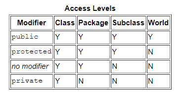
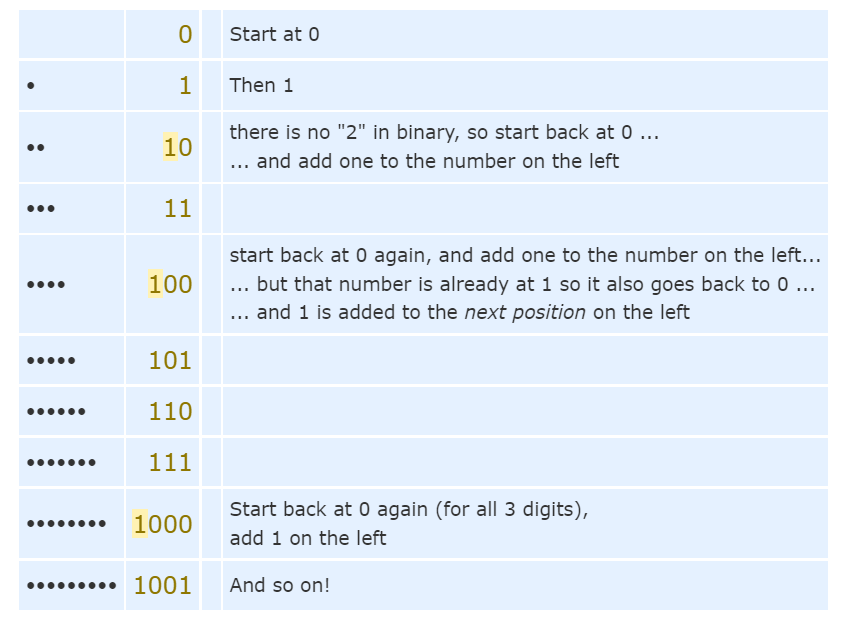
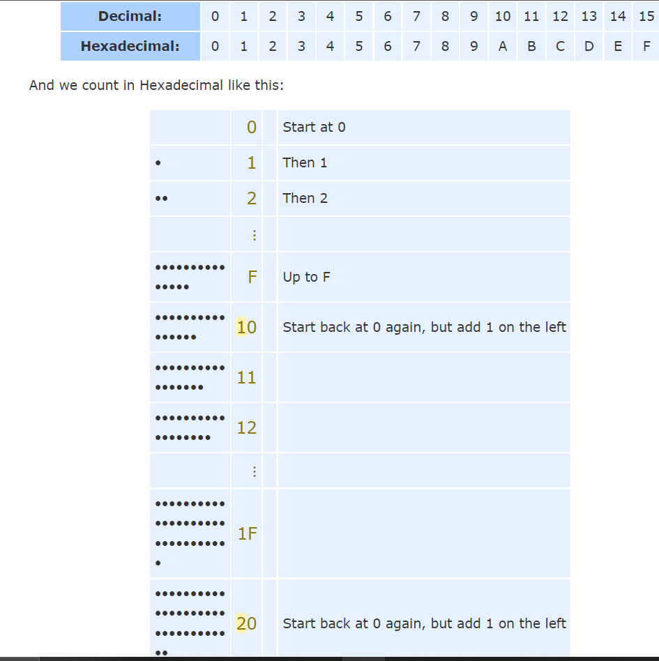

# Reading04

---

## Object

---

What Is an Object?

Objects are key to understanding object-oriented technology. Look around right now and you'll find many examples of real-world objects: your dog, your desk, your television set, your bicycle.

Real-world objects share two characteristics: They all have state and behavior. Dogs have state (name, color, breed, hungry) and behavior (barking, fetching, wagging tail). Bicycles also have state (current gear, current pedal cadence, current speed) and behavior (changing gear, changing pedal cadence, applying brakes). Identifying the state and behavior for real-world objects is a great way to begin thinking in terms of object-oriented programming.

For each object that you see, ask yourself two questions: "What possible states can this object be in?" and "What possible behavior can this object perform?". Make sure to write down your observations. As you do, you'll notice that real-world objects vary in complexity; your desktop lamp may have only two possible states (on and off) and two possible behaviors (turn on, turn off), but your desktop radio might have additional states (on, off, current volume, current station) and behavior (turn on, turn off, increase volume, decrease volume, seek, scan, and tune). You may also notice that some objects, in turn, will also contain other objects. These real-world observations all translate into the world of object-oriented programming.

---

## Class 

---

What Is a Class?

In the real world, you'll often find many individual objects all of the same kind. There may be thousands of other bicycles in existence, all of the same make and model. Each bicycle was built from the same set of blueprints and therefore contains the same components. In object-oriented terms, we say that your `bicycle` is an instance of `the class` of objects known as `bicycles`. `A class is the blueprint from which individual objects are created`.

### Declaring Classes 

    class MyClass {
    // field, constructor, and
    // method declarations
    }

* This is a class declaration. The class body (the area between the braces) contains all the code that provides for the life cycle of the objects created from the class: constructors for initializing new objects, declarations for the fields that provide the state of the class and its objects, and methods to implement the behavior of the class and its objects.

    
### Declaring Member Variables 

There are several kinds of variables:

* Member variables in a class—these are called fields.
* Variables in a method or block of code—these are called local variables.
* Variables in method declarations—these are called parameters.

### Access Modifiers 

* public modifier—the field is accessible from all classes.
* private modifier—the field is accessible only within its own class.

* All variables must have a type. You can use primitive types such as int, float, boolean, etc. Or you can use reference types, such as strings, arrays, or objects. 

### Variable Names

All variables, whether they are fields, local variables, or parameters, follow the same naming rules and conventions that were covered in the Language Basics lesson, Variables—Naming.

In this lesson, be aware that the same naming rules and conventions are used for method and class names, except that

* the first letter of a class name should be capitalized, and
* the first (or only) word in a method name should be a verb.

### Defining Methods

Here is an example of a typical method declaration:

    public double calculateAnswer(double wingSpan, int numberOfEngines,
    double length, double grossTons) {
    //do the calculation here
    }

* The only required elements of a method declaration are the method's `return type`, `name`, `a pair of parentheses`, `()`, and a body between braces, `{}`.

More generally, method declarations have six components, in order:

1- Modifiers—such as public, private, and others you will learn about later.

2- The return type—the data type of the value returned by the method, or void if the method does not return a value.

3- The method name—the rules for field names apply to method names as well, but the convention is a little different.

4- The parameter list in parenthesis—a comma-delimited list of input parameters, preceded by their data types, enclosed by parentheses, (). If there are no parameters, you must use empty parentheses.

5- An exception list—to be discussed later.

6- The method body, enclosed between braces—the method's code, including the declaration of local variables, goes here.

Modifiers, return types, and parameters will be discussed later in this lesson. Exceptions are discussed in a later lesson.

### Naming a Method 

In multi-word names, the first letter of each of the second and following words should be capitalized. Here are some examples:

run

runFast

getBackground

getFinalData

compareTo

setX

isEmpty

### Overloading Methods 

The Java programming language supports overloading methods, and Java can distinguish between methods with different method signatures. This means that methods within a class can have the same name if they have different parameter lists (there are some qualifications to this that will be discussed in the lesson titled "Interfaces and Inheritance").

Suppose that you have a class that can use calligraphy to draw various types of data (strings, integers, and so on) and that contains a method for drawing each data type. It is cumbersome to use a new name for each method—for example, drawString, drawInteger, drawFloat, and so on. In the Java programming language, you can use the same name for all the drawing methods but pass a different argument list to each method. Thus, the data drawing class might declare four methods named draw,

        public class DataArtist {
        ...
        public void draw(String s) {
        ...
        }
        public void draw(int i) {
        ...
        }
        public void draw(double f) {
        ...
        }
        public void draw(int i, double f) {
        ...
        }
        }

Overloaded methods are differentiated by the number and the type of the arguments passed into the method. In the code sample, draw(String s) and draw(int i) are distinct and unique methods because they require different argument types.

You cannot declare more than one method with the same name and the same number and type of arguments, because the compiler cannot tell them apart.

The compiler does not consider return type when differentiating methods, so you cannot declare two methods with the same signature even if they have a different return type.

### Providing Constructors for Your Classes 

A class contains constructors that are invoked to create objects from the class blueprint. Constructor declarations look like method declarations—except that they use the name of the class and have no return type. For example, Bicycle has one constructor:

    public Bicycle(int startCadence, int startSpeed, int startGear) {
    gear = startGear;
    cadence = startCadence;
    speed = startSpeed;
    }

### Passing Information to a Method or a Constructor

The declaration for a method or a constructor declares the number and the type of the arguments for that method or constructor. For example, the following is a method that computes the monthly payments for a home loan, based on the amount of the loan, the interest rate, the length of the loan (the number of periods), and the future value of the loan:

     public double computePayment(
     double loanAmt,
     double rate,
     double futureValue,
     int numPeriods) {
     double interest = rate / 100.0;
     double partial1 = Math.pow((1 + interest),
     - numPeriods);
     double denominator = (1 - partial1) / interest;
     double answer = (-loanAmt / denominator)
     - ((futureValue * partial1) / denominator);
    return answer;
    }

### Parameter Types
You can use any data type for a parameter of a method or a constructor. This includes primitive data types, such as doubles, floats, and integers, as you saw in the computePayment method, and reference data types, such as objects and arrays.

Here's an example of a method that accepts an array as an argument. In this example, the method creates a new Polygon object and initializes it from an array of Point objects (assume that Point is a class that represents an x, y coordinate):

    public Polygon polygonFrom(Point[] corners) {
    // method body goes here
    }

### Creating Objects
As you know, a class provides the blueprint for objects; you create an object from a class. Each of the following statements taken from the CreateObjectDemo program creates an object and assigns it to a variable:

Point originOne = new Point(23, 94);

Rectangle rectOne = new Rectangle(originOne, 100, 200);

Rectangle rectTwo = new Rectangle(50, 100);

The first line creates an object of the Point class, and the second and third lines each create an object of the Rectangle class.

Each of these statements has three parts (discussed in detail below):

Declaration: The code set in bold are all variable declarations that associate a variable name with an object type.

Instantiation: The new keyword is a Java operator that creates the object.

Initialization: The new operator is followed by a call to a constructor, which initializes the new object.

### Returning a Value from a Method

A method returns to the code that invoked it when it

completes all the statements in the method,

reaches a return statement, or

throws an exception (covered later),

whichever occurs first.

You declare a method's return type in its method declaration. Within the body of the method, you use the return statement to return the value.

Any method declared void doesn't return a value. It does not need to contain a return statement, but it may do so. In such a case, a return statement can be used to branch out of a control flow block and exit the method and is simply used like this:

return;
If you try to return a value from a method that is declared void, you will get a compiler error.

Any method that is not declared void must contain a return statement with a corresponding return value, like this:

return returnValue;
The data type of the return value must match the method's declared return type; you can't return an integer value from a method declared to return a boolean.

The getArea() method in the Rectangle Rectangle class that was discussed in the sections on objects returns an integer:

    // a method for computing the area of the rectangle
    public int getArea() {
        return width * height;
    }

### Using the this Keyword

Within an instance method or a constructor, this is a reference to the current object — the object whose method or constructor is being called. You can refer to any member of the current object from within an instance method or a constructor by using this.

Using this with a Field

The most common reason for using the this keyword is because a field is shadowed by a method or constructor parameter.

For example, the Point class was written like this

    public class Point {
    public int x = 0;
    public int y = 0;

    //constructor
    public Point(int a, int b) {
        x = a;
        y = b;
    }
    }

Controlling Access to Members of a Class

Access level modifiers determine whether other classes can use a particular field or invoke a particular method. There are two levels of access control:

* At the top level—public, or package-private (no explicit modifier).
* At the member level—public, private, protected, or package-private (no explicit modifier).

;

Ex of Class have attribute and method :

    class Bicycle {

    int cadence = 0;
    int speed = 0;
    int gear = 1;

    void changeCadence(int newValue) {
         cadence = newValue;
    }

    void changeGear(int newValue) {
         gear = newValue;
    }

    void speedUp(int increment) {
         speed = speed + increment;   
    }

    void applyBrakes(int decrement) {
         speed = speed - decrement;
    }

    void printStates() {
         System.out.println("cadence:" +
             cadence + " speed:" + 
             speed + " gear:" + gear);
    }
    }

* You may have noticed that the Bicycle class does not contain a main method. That's because it's not a complete application; it's just the blueprint for bicycles that might be used in an application. The responsibility of creating and using new Bicycle objects belongs to some other class in your application.

Here's a BicycleDemo class that creates two separate Bicycle objects and invokes their methods:

       class BicycleDemo {
        public static void main(String[] args) {

        // Create two different 
        // Bicycle objects
        Bicycle bike1 = new Bicycle();
        Bicycle bike2 = new Bicycle();

        // Invoke methods on 
        // those objects
        bike1.changeCadence(50);
        bike1.speedUp(10);
        bike1.changeGear(2);
        bike1.printStates();

        bike2.changeCadence(50);
        bike2.speedUp(10);
        bike2.changeGear(2);
        bike2.changeCadence(40);
        bike2.speedUp(10);
        bike2.changeGear(3);
        bike2.printStates();
    }
    }

---

# Binary, Decimal and Hexadecimal Numbers 

---

Decimals
How do Decimal Numbers work?

Every digit in a decimal number has a "position", and the decimal point helps us to know which position is which:

decimal 17.591

The position just to the left of the point is the "Ones" position. If we see a "7" there we know it means 7 ones.

Every position further to the left is 10 times bigger, and every position further to the right is 10 times smaller

This is just a way of writing down a value. Other ways include Roman Numerals, Binary, Hexadecimal, and more. You could even just draw dots on a sheet of paper!

## Bases
The Decimal Number System is also called "Base 10", because it is based on the number 10, with these 10 symbols:

0, 1, 2, 3, 4, 5, 6, 7, 8 and 9

But notice something interesting: there is no symbol for "ten". "10" is actually two symbols put together, a "1" and a "0":

* In decimal you count "0,1,2,3,4,5,6,7,8,9,..." but then you run out of symbols!
So you add 1 on the left and then start again at 0: 10,11,12, ...

## Counting with Different Number Systems

But you don't have to use 10 as a "Base". You could use 2 ("Binary"), 16 ("Hexadecimal"), or any number you want to!

* Example: In binary you count "0,1,..." but then you run out of symbols!
So you add 1 on the left and then start again at 0: 10,11 ...

## Binary Numbers

Binary Numbers are just "Base 2" instead of "Base 10". So you start counting at 0, then 1, then you run out of digits ... so you start back at 0 again, but increase the number on the left by 1.

Like this:

## Hexadecimal Numbers

Hexadecimal numbers are interesting. There are 16 of them!

They look the same as the decimal numbers up to 9, but then there are the letters ("A',"B","C","D","E","F") in place of the decimal numbers 10 to 15.

So a single Hexadecimal digit can show 16 different values instead of the normal 10 like this:

                               by Hameh Abu-Amer

