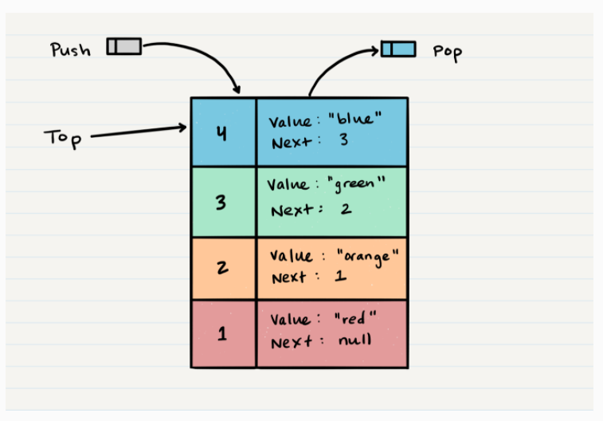

# Stacks and Queues

---

What is a Stack?

A stack is a data structure that consists of Nodes. Each Node references the next Node in the stack, but does not reference its previous.

Common terminology for a stack is

* Push - Nodes or items that are put into the stack are pushed
* Pop - Nodes or items that are removed from the stack are popped. When you attempt to pop an empty stack an exception will be raised.
* Top - This is the top of the stack.
* Peek - When you peek you will view the value of the top Node in the stack. When you attempt to peek an empty stack an exception will be raised.
* IsEmpty - returns true when stack is empty otherwise returns false.

* Have many concepts like : 

FILO:

First In Last Out

LIFO

Last In First Out

## Stack Visualization

Here’s an example of what a stack looks like. As you can see, the topmost item is denoted as the top. When you push something to the stack, it becomes the new top. When you pop something from the stack, you pop the current top and set the next top as top.next.

Pop O(1)

Popping a Node off a stack is the action of removing a Node from the top. When conducting a pop, the top Node will be re-assigned to the Node that lives below and the top Node is returned to the user.

Typically, you would check isEmpty before conducting a pop. This will ensure that an exception is not raised. Alternately, you can wrap the call in a try/catch block.

Let’s try and pop off Node 5 from the stack. Here is a visual of the current state of our stack:

---

 What is a Queue?

Common terminology for a queue is

* Enqueue - Nodes or items that are added to the queue.
* Dequeue - Nodes or items that are removed from the queue. If called when the queue is empty an exception will be raised.
* Front - This is the front/first Node of the queue.
* Rear - This is the rear/last Node of the queue.
* Peek - When you peek you will view the value of the front Node in the queue. If called when the queue is empty an exception will be raised.
* IsEmpty - returns true when queue is empty otherwise returns false.

Here is the pseudocode for the dequeue method:

    ALGORITHM dequeue()
    // INPUT <-- none
    // OUTPUT <-- value of the removed Node
    // EXCEPTION if queue is empty
    
    Node temp <-- front
    front <-- front.next
    temp.next <-- null
    
    return temp.value

Here is the pseudocode for a peek

    ALGORITHM peek()
    // INPUT <-- none
    // OUTPUT <-- value of the front Node in Queue
    // EXCEPTION if Queue is empty
    
    return front.value

IsEmpty O(1)

Here is the pseudocode for isEmpty

    ALGORITHM isEmpty()
    // INPUT <-- none
    // OUTPUT <-- boolean
    
    return front = NULL